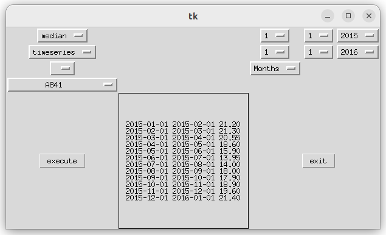

# Modern Database Systems 

Module: Modern Database Systmes

Degree: Master Digital Science 

Name: Finn Heydemann

Lecturer: Prof. Dr. Johann Schaible 

In this project SQL and NoSQL, namely InfluxDB, are compared to query timeseries data. The data source is [Climate Weather Surface of Brazil - Hourly](https://www.kaggle.com/datasets/PROPPG-PPG/hourly-weather-surface-brazil-southeast-region) from which two weather stations from every region are randomly selected. 

Both databases query average or median temperature either based on a region ("north", "northeast", "central west", "southeast or "south") or based on a single station belonging to a region. Futhermore a time range and a group by for example years or months can be specified. 

Python scripts are programmed to: 

a) remodel the data for either the SQL or NoSQL Database, 

b) write data to the influx database,

c) query the data into a graphical user interface. 

Please read the project report for further insights. 

